# Selorah Health - Architecture Diagrams & Flowcharts

**Document Version**: 1.0.0  
**Last Updated**: May 2026  
**Audience**: Technical Architects, Developers

> This document contains visual representations of the Selorah Health system architecture using flowcharts and sequence diagrams.

---

## Table of Contents

1. [System Overview Diagram](#system-overview-diagram)
2. [Data Flow Architecture](#data-flow-architecture)
3. [User Authentication Flow](#user-authentication-flow)
4. [Medical Record Sharing Flow](#medical-record-sharing-flow)
5. [QR Code Access Control Flow](#qr-code-access-control-flow)
6. [Real-time Synchronization Architecture](#real-time-synchronization-architecture)
7. [Component Interaction Diagram](#component-interaction-diagram)
8. [Database Schema Relationships](#database-schema-relationships)
9. [Deployment Architecture](#deployment-architecture)
10. [API Request Flow](#api-request-flow)

---

## System Overview Diagram

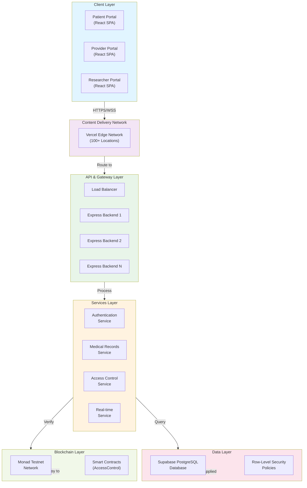

---

## Data Flow Architecture

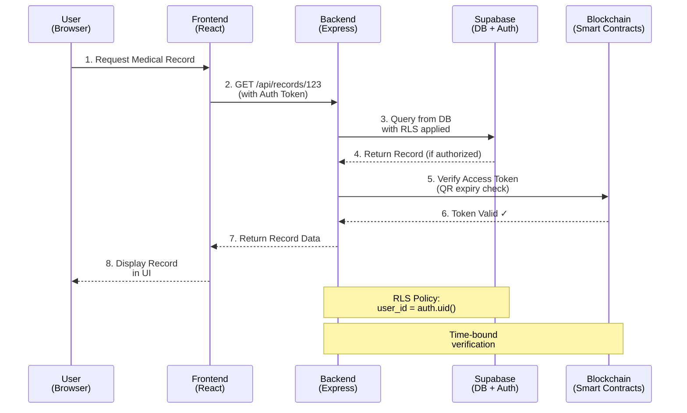

---

## User Authentication Flow

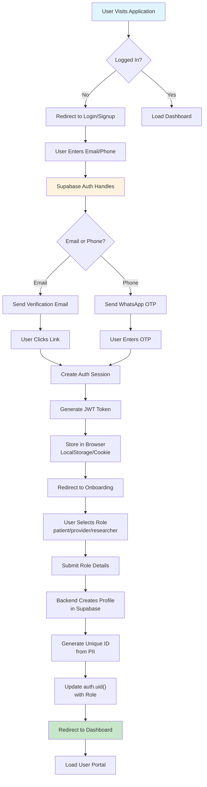

---

## Medical Record Sharing Flow

```mermaid
graph LR
    subgraph Patient["Patient Action"]
        A["Patient Opens<br/>My Records"]
        B["Selects Record<br/>to Share"]
        C["Chooses Access<br/>Duration"]
    end

    subgraph Backend["Backend Processing"]
        D["Validate Patient<br/>Ownership"]
        E["Generate Unique<br/>Token"]
        F["Create QR Code<br/>with Token"]
        G["Store in DB<br/>with Expiry"]
    end

    subgraph Blockchain["Blockchain Verification"]
        H["Encode Token<br/>in Smart Contract"]
        I["Set Expiration<br/>Time"]
        J["Log Event"]
    end

    subgraph Provider["Provider Action"]
        K["Scan QR Code"]
        L["Extract Token"]
        M["Request Record<br/>with Token"]
    end

    subgraph Access["Access Verification"]
        N["Verify Token<br/>Valid"]
        O["Check Expiry<br/>Time"]
        P["RLS Policy Check<br/>user_id Match"]
        Q["Smart Contract<br/>Verification"]
    end

    subgraph Return["Return Data"]
        R["Log Access<br/>in access_logs"]
        S["Return Record<br/>to Provider"]
        T["Emit Socket Event<br/>to Patient"]
    end

    A --> B --> C --> D --> E --> F --> G
    G --> H --> I --> J
    K --> L --> M
    M --> N --> O --> P --> Q
    Q --> R --> S --> T

    style Patient fill:#e3f2fd
    style Backend fill:#f3e5f5
    style Blockchain fill:#f1f8e9
    style Provider fill:#fce4ec
    style Access fill:#fff3e0
    style Return fill:#c8e6c9
```

---

## QR Code Access Control Flow

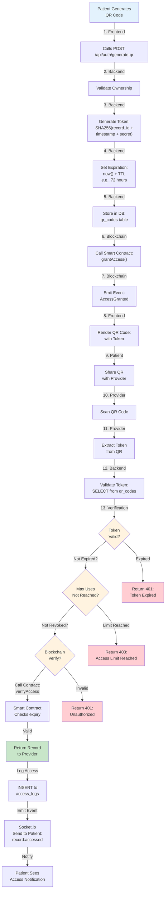

---

## Real-time Synchronization Architecture

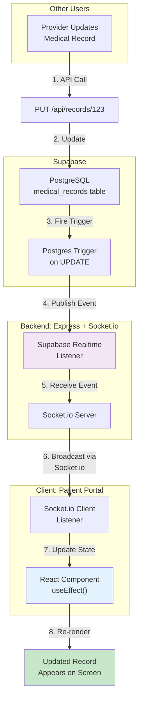

**Key Technologies**:
- **Supabase Realtime**: PostgreSQL change listeners
- **Socket.io**: WebSocket for instant delivery
- **React useEffect**: Client-side state management
- **RLS Policies**: Ensure only authorized users receive updates

---

## Component Interaction Diagram

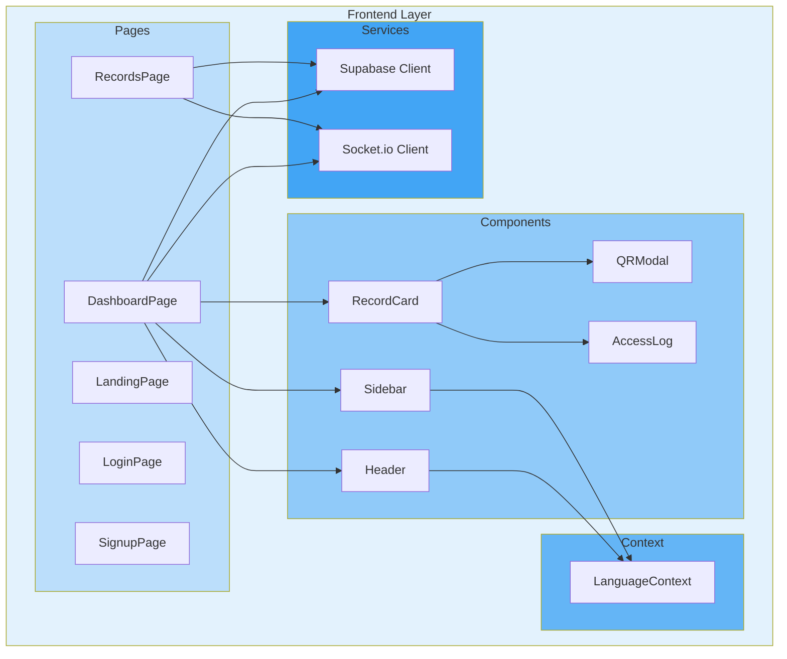

---

## Database Schema Relationships

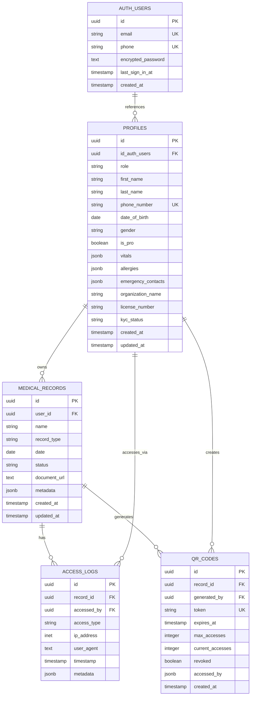

---

## Deployment Architecture

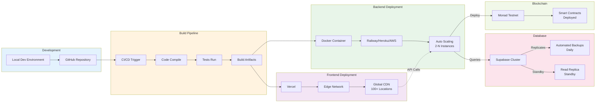

---

## API Request Flow

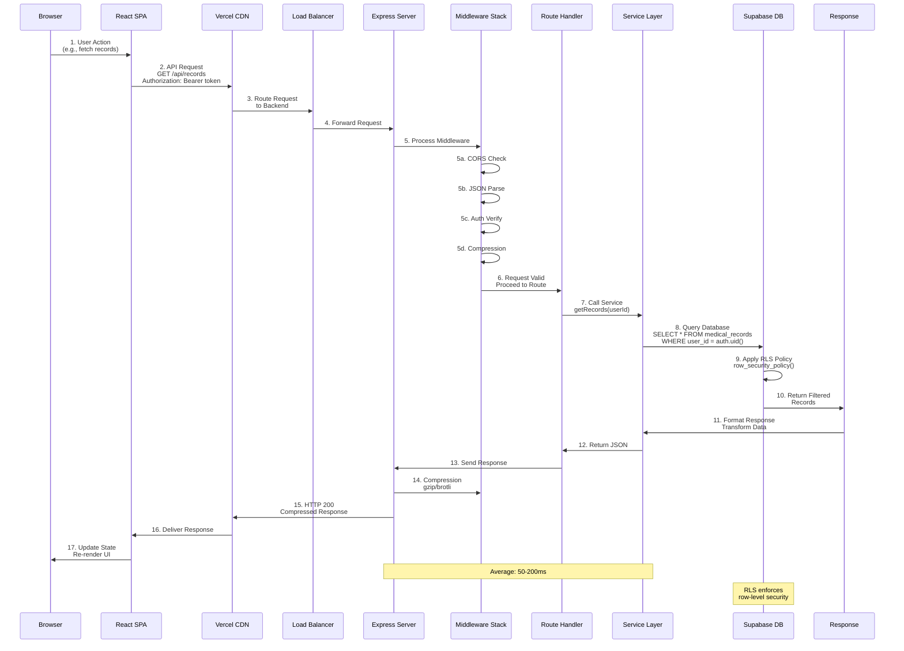

---

## Authentication & Authorization Layers

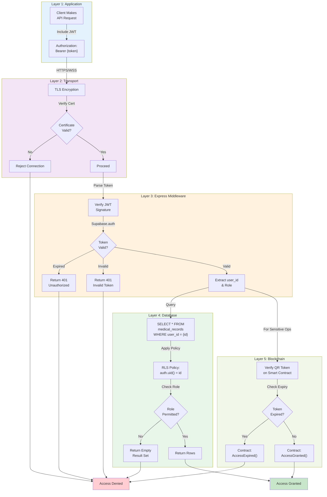

---

## Conclusion

These diagrams provide a comprehensive visual representation of:

✅ **System Architecture** - How components interact  
✅ **Data Flow** - How information moves through the system  
✅ **Authentication** - Multi-layer security model  
✅ **Real-time Features** - WebSocket-based synchronization  
✅ **Deployment** - Production deployment architecture  
✅ **Database** - Schema relationships and structure  

For more details, refer to [architecture.md](architecture.md) and [README.md](README.md).
